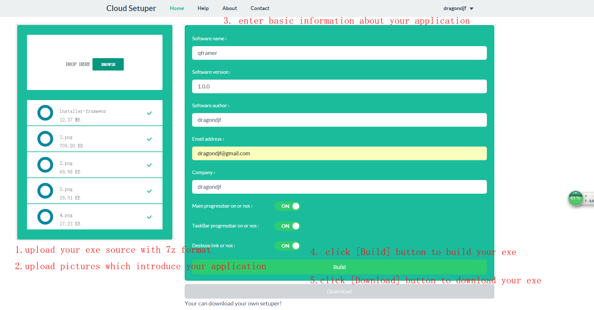
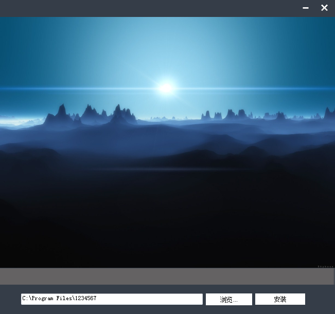
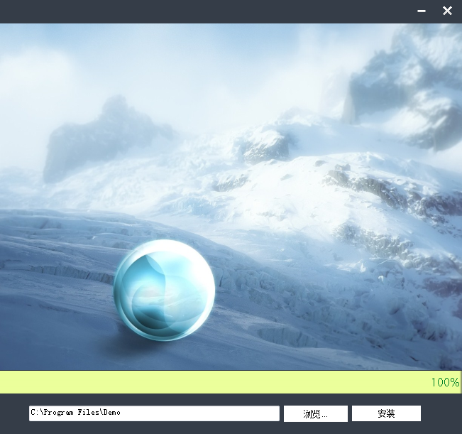

CloudSetuper

####1. Introduce
    
`Cloud setuper` is a free online tool for software developer to pack their software in one setup exe which has same function like <a href="http://nsis.sourceforge.net/">NSIS</a> or <a href="http://www.jrsoftware.org/isinfo.php">Inno Setup</a>.Cloud setuper is much more pretty.

####2. How to use Cloud setuper

####3.Suggestion   

+ 1. The best size of picture which you upload shoud be 650 * 400. 
+ 2. The <a href="http://www.7-zip.org/">7z</a> tool should be latest.
+ 3. If it fails to build, please try it again by press F5

####4.Setuper demo

