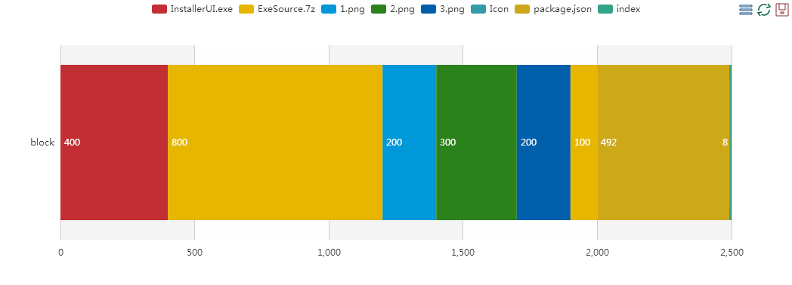

CloudSetuper

####1. 简介
    
CloudSetuper 旨在为软件开发者提供一个在线的安装包制作工具，它可以通过用户web上传的可发布程序、安装包美化需要的素材和安装配置选项在后台自动生成一个个性化的安装包，用户可以通过web实时查看安装包制作的进度，安装包制作完成后自动生成下载链接返回给用户，用户点击链接即可下载自己制作的安装包程序。

####2.项目组成部分：
CloudSetuper由两部分构成：

+ setuper web app 安装包制作在线交互并提供对外服务 
+ setuper app 一键制作安装包

####3. setuper web server模块功能分析
+ 用户注册，认证和管理模块
+ 安装包在线交互模块
    + 文件上传
    + 安装包安装页面预览
    + 安装制作进度预览
+ 用户项目管理模块
    + 独立的用户项目主页
    + 项目记录查询
    + 项目批量下载

####4. setuper app 模块功能分析
+ 安装界面UI模板工具 **``InstallerUI.exe``**
+ 安装包工具 **``InstallerCopy.exe``**
+ 安装配置文件 **``package.json``** 

例如程序目录``E:\app\ ``如下   

+ InstallerCopy.exe
+ package
    + InstallerUI.exe
    + ExeSource.7z
    + 1.png
    + 2.png
    + 3.png
    + setup.ico
    + package.json
``cd ``到当前目录

        cd "E:\app\"
        InstallerCopy.exe package

package.json示例：  

    {
        "InstallerUI.exe": {
            "path": "E:\\app\\package\\InstallerUI.exe",
        },
        "ExeSource.7z":{
            "path": "E:\\app\\package\\ExeSource.7z",
        },
        "1.png":{
            "path": "E:\\app\\package\\1.png",
        },
        "2.png":{
            "path": "E:\\app\\package\\2.png",
        },
        "3.png":{
            "path": "E:\\app\\package\\3.png",
        },
        "Icon":{
            "path": "E:\\app\\package\\setup.ico",
        },
        "OutputPath": "c\\program files",
        "FinishedOpenFlag": true,
        "HomePage": "http://dragondjf.github.io/",
    }

经过InstallerCopy.exe处理后的package.json

    {
        "InstallerUI.exe": {
            "path": "E:\\app\\package\\InstallerUI.exe",
            "start": -2100,
            "size": 500
        },
        "ExeSource.7z":{
            "path": "E:\\app\\package\\ExeSource.7z",
            "start": -1300,
            "size": 800,
        },
        "1.png":{
            "path": "E:\\app\\package\\1.png",
            "start": -1100,
            "size": 200,
        },
        "2.png":{
            "path": "E:\\app\\package\\2.png",
            "start": -800,
            "size": 300,
        },
        "3.png":{
            "path": "E:\\app\\package\\3.png",
            "start": -600,
            "size": 200,
        },
        "Icon":{
            "path": "E:\\app\\package\\setup.ico",
            "start": -500,
            "size": 100,
        },
        "SaveOrder":["InstallerUI.exe", "ExeSource.7z", "1.png", "2.png", "3.png", "IconPath.ico"],
        "OutputPath": "c\\program files",
        "FinishedOpenFlag": true,
        "HomePage": "http://dragondjf.github.io/",
    }

最终程序结构分区如下

